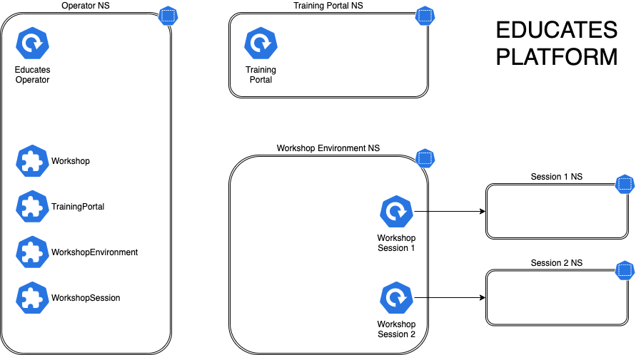

.. _project-overview:

مروری بر پروژه
==============

پروژه Educates به منظور فراهم‌سازی بستری برای میزبانی کارگاه‌های آموزشی طراحی شده است. این پلتفرم در ابتدا برای پشتیبانی از تیمی از Developer Advocateها ایجاد شد که نیاز داشتند کاربران را در استفاده از Kubernetes آموزش دهند و ابزارها یا برنامه‌های اجراشده روی Kubernetes را معرفی کنند.

اگرچه بستر اصلی استقرار Educates، کلاستر Kubernetes است و از آن برای آموزش Kubernetes استفاده می‌شود، اما این پلتفرم می‌تواند برای اهداف آموزشی دیگر نیز مورد استفاده قرار گیرد؛ برای مثال آموزش برنامه‌های تحت وب، پایگاه‌های داده یا زبان‌های برنامه‌نویسی، حتی زمانی که کاربر نیازی به Kubernetes نداشته باشد.

--------------------------------------------------------------------

.. _source-code-repositories:

مخازن کد پروژه
--------------

مخزن کد منبع پلتفرم Educates در آدرس زیر در دسترس است:

https://github.com/educates/educates-training-platform

--------------------------------------------------------------------

.. _latest-project-release:

آخرین نسخه انتشار پروژه
------------------------

برای مشاهده جدیدترین نسخه منتشرشده Educates به لینک زیر مراجعه کنید:

https://github.com/educates/educates-training-platform/releases/latest

--------------------------------------------------------------------

.. _getting-help-with-educates:

دریافت راهنما درباره Educates
------------------------------

در صورت داشتن سوال درباره استفاده از Educates، از کانال ``#educates`` در Slack جامعه Kubernetes استفاده کنید:

https://kubernetes.slack.com/

در صورت یافتن باگ یا درخواست قابلیت جدید، از Issue Tracker گیت‌هاب استفاده نمایید:

https://github.com/educates/educates-training-platform/issues

--------------------------------------------------------------------

.. _overall-goals-of-the-project:

اهداف کلی پروژه
----------------

Educates بر اساس نیازهای تیم‌های Developer Advocate طراحی شده و سناریوهای زیر را پشتیبانی می‌کند:

**کارگاه‌های نظارت‌شده**

کارگاهی که در یک کنفرانس، محل مشتری یا به‌صورت آنلاین برگزار می‌شود. مدت زمان مشخصی دارد و تعداد کاربران مشخص است. پس از پایان کارگاه، کلاستر Kubernetes ایجادشده حذف می‌شود.

**پرتال آموزشی موقت**

ارائه مجموعه‌ای کوچک از کارگاه‌های کوتاه‌مدت برای دموی عملی (مثلاً در غرفه نمایشگاهی). کاربران موضوع را انتخاب می‌کنند و نمونه کارگاه به‌صورت On-Demand ایجاد می‌شود. پس از اتمام، محیط حذف شده و در پایان رویداد، کل کلاستر حذف می‌شود.

**پرتال آموزشی دائمی**

مشابه حالت موقت اما به‌صورت دائمی و عمومی، به‌گونه‌ای که کاربران در هر زمان بتوانند وارد شده و آموزش ببینند.

**آموزش یا دموی شخصی**

اجرای کارگاه روی کلاستر شخصی برای یادگیری یا ارائه دموی محصول. محیط کارگاه پس از اتمام می‌تواند حذف شود، اما نیازی به حذف کل کلاستر نیست.

---

در استقرار Educates روی Kubernetes، هدف این بوده که در صورت امکان از یک کلاستر اشتراکی استفاده شود تا نیاز به راه‌اندازی چندباره کاهش یابد. این مدل برای کارگاه‌های توسعه‌محور که تنها به یک Namespace نیاز دارند مناسب است، زیرا معمولاً نیازی به دسترسی سطح بالا به کلاستر وجود ندارد و با استفاده از RBAC می‌توان از تداخل کاربران جلوگیری کرد. همچنین می‌توان برای هر Session محدودیت منابع (Quota) تعیین کرد.

در مواردی که کارگاه مربوط به عملیات سطح کلاستر باشد و نیاز به دسترسی Cluster Admin وجود داشته باشد، می‌توان یک Virtual Cluster جداگانه در همان کلاستر ایجاد کرد. همچنین می‌توان با استفاده از KubeVirt ماشین مجازی لینوکسی ایجاد کرد یا حتی از منابع سفارشی برای درخواست کلاسترهای کاملاً جداگانه استفاده نمود.

---

الزامات اصلی برای تولید محتوای کارگاه شامل موارد زیر بوده است:

- تمام اجزای کارگاه باید در یک مخزن Git ذخیره شوند.
- امکان توزیع محتوا از طریق Git یا Image Registry وجود داشته باشد.
- دستورالعمل‌ها در قالب Markdown یا AsciiDoc ارائه شوند.
- امکان اجرای خودکار دستورات با کلیک روی آن‌ها در داشبورد وجود داشته باشد.
- امکان کپی سریع متن با یک کلیک فراهم باشد.
- هر کاربر Namespace اختصاصی داشته باشد.
- منابع Kubernetes مخصوص هر Session به‌صورت خودکار ایجاد شوند.
- منابع مشترک هنگام ایجاد Environment ساخته شوند.
- اعمال Resource Quota برای هر Session.
- اعمال RBAC برای کنترل سطح دسترسی کاربران.
- ارائه ویرایشگر (IDE) تحت وب در داشبورد.
- ارائه کنسول تحت وب Kubernetes.
- امکان ادغام برنامه‌های وب دیگر در داشبورد.
- امکان نمایش اسلایدهای مدرس در داشبورد کارگاه.

با گذشت زمان، قابلیت‌های پلتفرم فراتر از این الزامات اولیه گسترش یافته است.

--------------------------------------------------------------------

.. _platform-architectural-overview:

مروری بر معماری پلتفرم
-----------------------

پلتفرم Educates مبتنی بر یک Kubernetes Operator است که بخش عمده عملیات را انجام می‌دهد. این Operator از طریق مجموعه‌ای از Custom Resourceهای اختصاصی کنترل می‌شود.

روش اصلی استقرار کارگاه‌ها به این صورت است:

1. ایجاد یک ``TrainingPortal``
2. تعریف یک یا چند ``Workshop``
3. ایجاد ``WorkshopEnvironment``
4. تخصیص ``WorkshopSession`` به هر کاربر

هر WorkshopSession می‌تواند شامل یک یا چند Namespace اختصاصی باشد. با اعمال RBAC روی Service Account هر Session، کاربر فقط به منابع مجاز دسترسی خواهد داشت.

منابع سفارشی اصلی شامل:

``Workshop``  
تعریف کامل کارگاه شامل محل نگهداری محتوا، منابع مشترک و تنظیمات دسترسی.

``TrainingPortal``  
ایجاد پرتال آموزشی و مدیریت ثبت‌نام و تخصیص Session.

``WorkshopEnvironment``  
ایجاد محیط اجرای کارگاه و منابع مشترک.

``WorkshopSession``  
ایجاد Session اختصاصی برای هر کاربر و منابع مرتبط.

اگرچه API اصلی مبتنی بر منابع Kubernetes است، یک ابزار CLI نیز برای ساده‌سازی استقرار محلی ارائه شده است.
