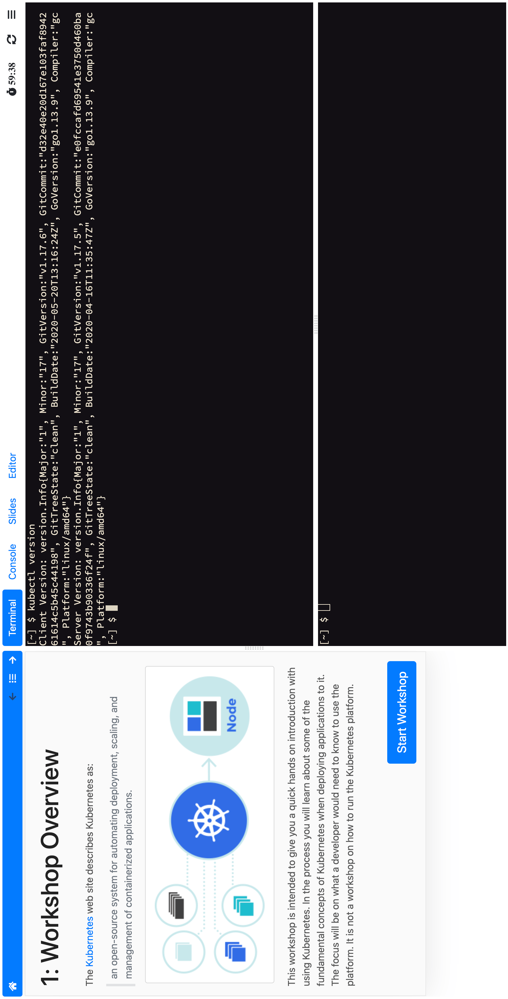
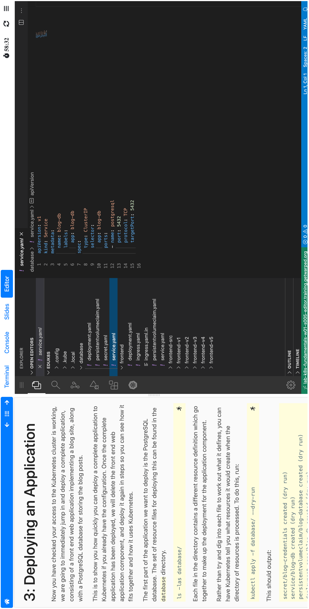
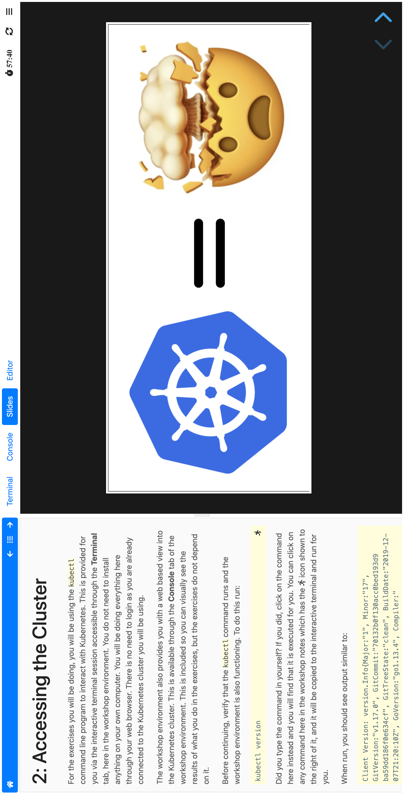
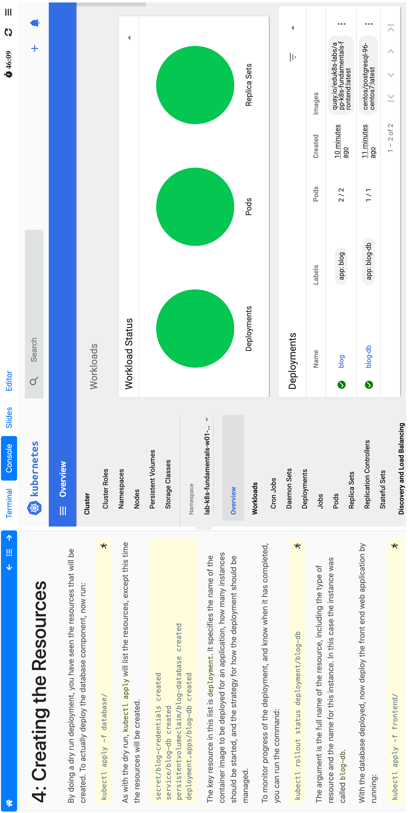
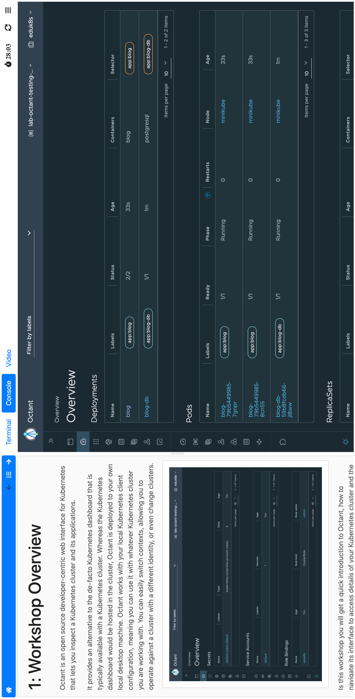

.. _sample-screenshots:

نمونه اسکرین‌شات‌ها
====================

این صفحه شامل نمونه‌هایی از داشبورد کارگاه و قابلیت‌های مختلف پلتفرم Educates است.
تصاویر زیر بخش‌های مختلف محیط اجرای کارگاه را نشان می‌دهند.

--------------------------------------------------------------------

ترمینال داخلی کارگاه
---------------------

کاربران می‌توانند از طریق ترمینال داخلی، دستورات مورد نیاز کارگاه را اجرا کنند.
این ترمینال معمولاً برای اجرای دستورات Kubernetes یا ابزارهای توسعه استفاده می‌شود.

--------------------------------------------------------------------

ویرایشگر کد (IDE) تحت وب
--------------------------

در صورت فعال بودن در کارگاه، یک ویرایشگر کد تحت وب در داشبورد در دسترس خواهد بود
که کاربران می‌توانند فایل‌ها را مشاهده و ویرایش کنند.

--------------------------------------------------------------------

نمایش اسلایدهای آموزشی
------------------------

داشبورد می‌تواند اسلایدهای آموزشی مدرس را نیز نمایش دهد تا کاربر همزمان با
مطالعه راهنما، اسلایدها را مشاهده کند.

--------------------------------------------------------------------

کنسول Kubernetes
-----------------

در برخی کارگاه‌ها امکان دسترسی به داشبورد استاندارد Kubernetes برای
مشاهده و مدیریت منابع فراهم است.

--------------------------------------------------------------------

کنسول Octant (قدیمی)
---------------------

در نسخه‌های قدیمی‌تر، امکان استفاده از کنسول Octant برای مشاهده وضعیت
کلاستر وجود داشت. این قابلیت در نسخه‌های جدیدتر در حال حذف شدن است.

